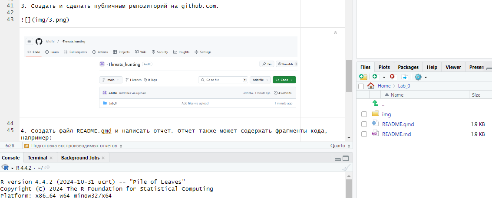

# Подготовка воспроизводимых отчетов
konstantinsmirnitsky@yandex.ru

# Подготовка воспроизводимых отчетов

## Цель работы

1.  Развить практические навыки использования современного стека
    воспроизводимых исследований

2.  Закрепить знания о современных сетевых протоколах прикладного уровня

## Исходные данные

1.  Программное обеспечение Windows 10

2.  Rstudio Desktop

3.  Интерпретатор языка R 4.4.2

## План

1.  Подготовить рабочее окружение для работы с RStudio

2.  Разработать отчет с использованием стека технологий Rmarkdown и
    Quarto

3.  Оформить отчет в соответствии с шаблоном

## Шаги

1.  Скачать и установить R для Windows.


1.  Скачать и установить RStudio для Windows. 

2.  Создать и сделать публичным репозиторий на github.com.


1.  Создать файл README.qmd и написать отчет. Отчет также может
    содержать фрагменты кода, например:

``` r
print('hello, world!')
```

    [1] "hello, world!"



## Оценка результата

В результате выполнения работы отчет был подготовлен с использованием
языка разметки Markdown.

## Вывод

Мы научились создавать и делать отчет в RStudio, а также загружать
работы на GitHub.
